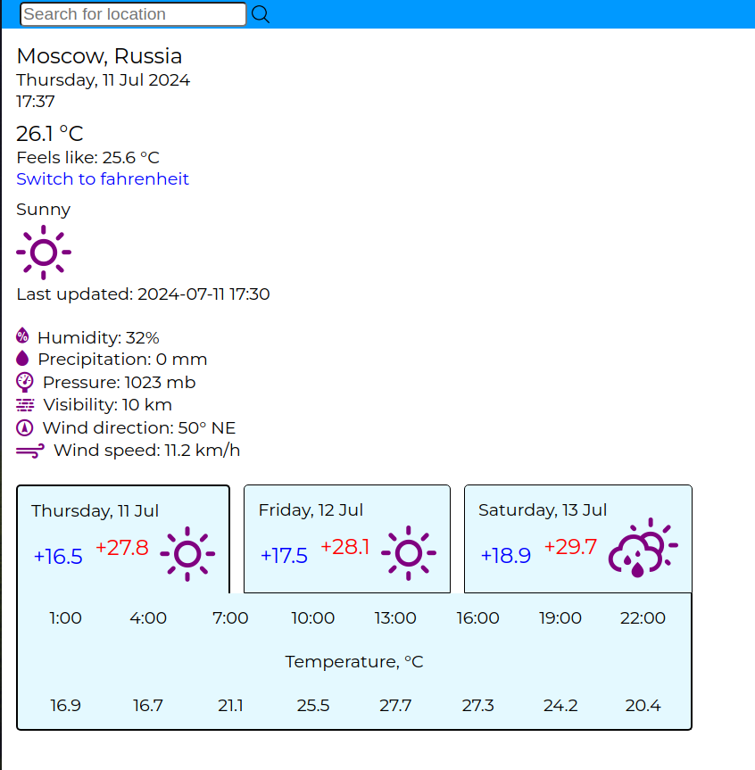

# weather-app
A basic weather app which has current weather condition for different locations, additional information: humidity, precipitation, pressure, visibility, wind direction, wind speed and 3 day weather forecast.

Live preview in the "About" section. 

Weather app made using free api key of [weather api](https://www.weatherapi.com/).
[Weather icons by Erik Flowers](https://erikflowers.github.io/weather-icons/).